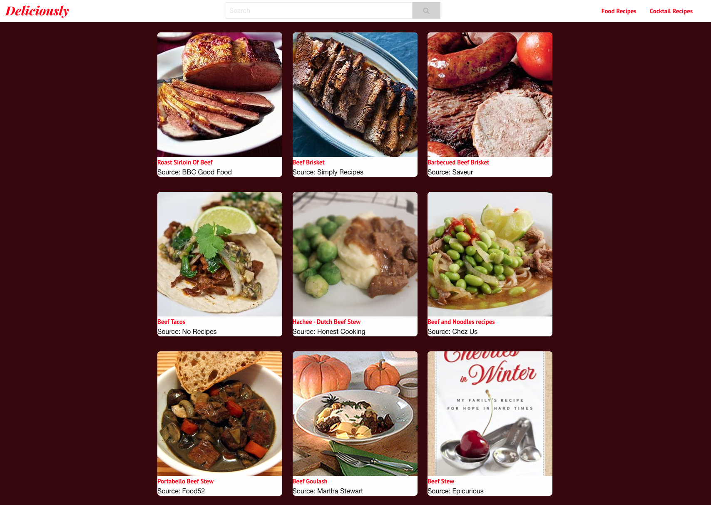
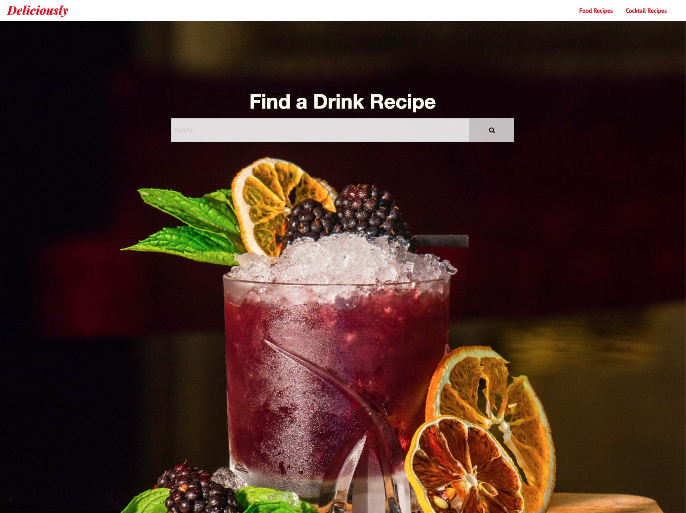
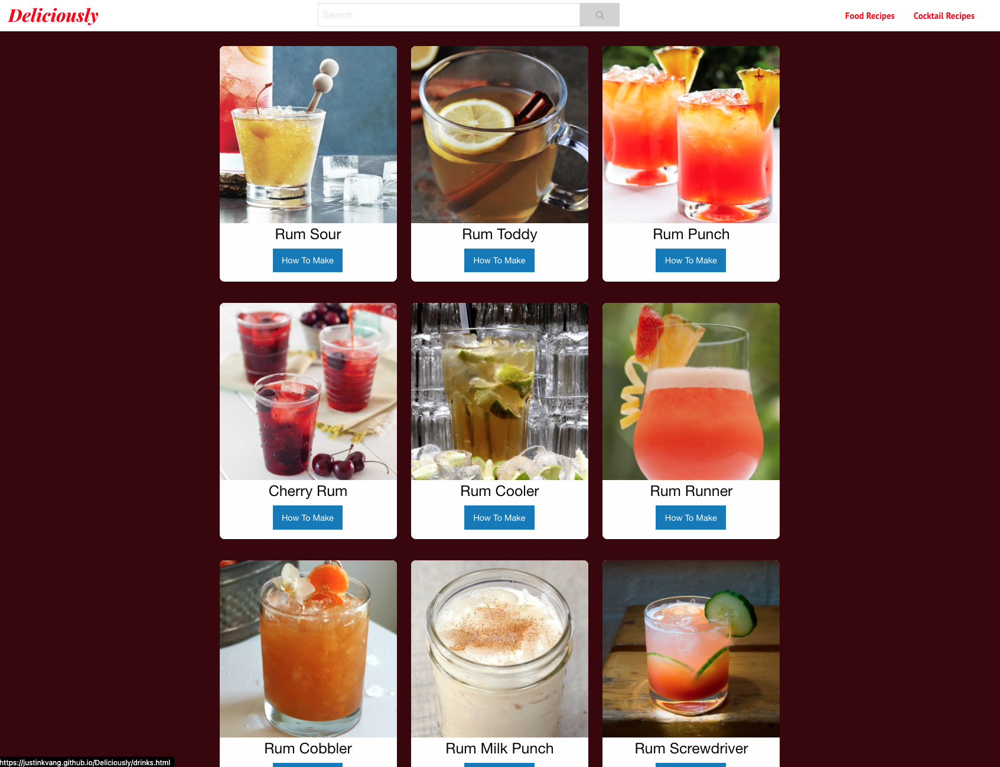

**Deliciously**
Deliciously is a website designed to search for food and cocktail recipes using simple key words. 

## How to Use
- Open the page. The default page is set to search for food recipes. 
- If you would like to search for food recipes...
    1. Type in a key word(s) into the search box (ex. "chicken"), and the page will populate with a set of recipes related to the keyword.
    2. Choose what dish is appealing to you and click on the card to bring you to the recipe source. (Note: this will bring you to the original website the recipe is sourced from)
- If you would like to search for cocktail recipes...
    1. Click on the 'Cocktail Recipes' link on the top right corner to access the cocktail recipes page. 
    2. Type in a key word(s) into the serach box (ex. "tequila"), and the page will populate with a set of cocktail recipes related to the keyword.
    3. Choose what cocktail appeals to you and ........

## Links
- [Deployed website](https://justinkvang.github.io/Deliciously/)
- [Repo](https://github.com/justinkvang/Deliciously)

## Screenshots
- 
- 
- 
- 

## Tools and APIs Utilized
- HTML
- CSS
- JavaScript
- [Foundation](https://get.foundation/index.html)
- [Edamam API](https://developer.edamam.com/)
- [TheCocktailDB API](https://www.thecocktaildb.com/)
- [jQuery CDN](https://code.jquery.com/)
- [font-awesome CDN](https://cdnjs.com/libraries/font-awesome)

## Credit
### Hungry Team Members
- [Chaltu Abdulkadir](https://github.com/cmabdulkadir?tab=repositories)
- [Carson Scholberg](https://github.com/CarsonScholberg)
- [Jacob Doty](https://github.com/jacobdoty-20)
- [Justin Vang](https://github.com/justinkvang) 

### Background Images
- Drink Background -> [Proriat Hospitality](https://unsplash.com/photos/lwoTuByIuC4?utm_source=unsplash&utm_medium=referral&utm_content=creditShareLink)
- Food Background -> [Brooke Lark](https://unsplash.com/photos/M4E7X3z80PQ?utm_source=unsplash&utm_medium=referral&utm_content=creditShareLink)

### Inspiration
[Epicurious](https://www.epicurious.com/)